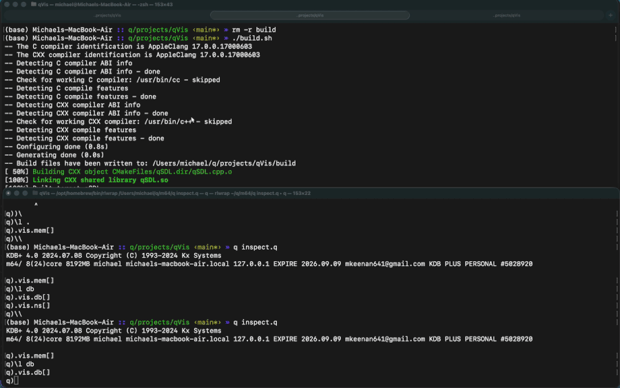
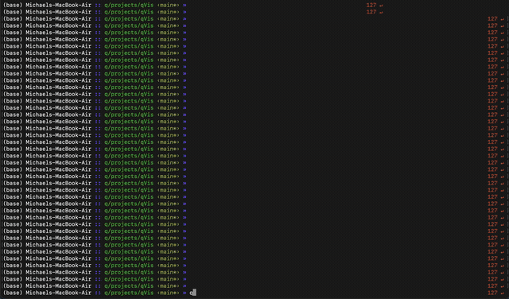
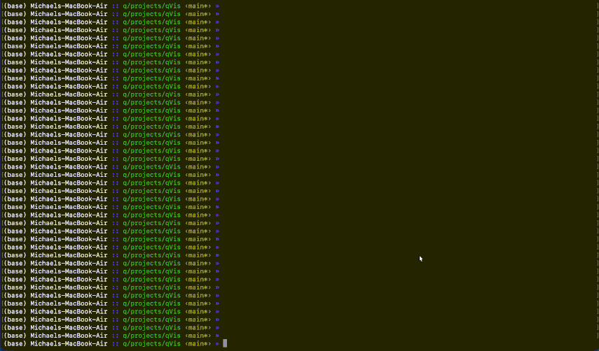
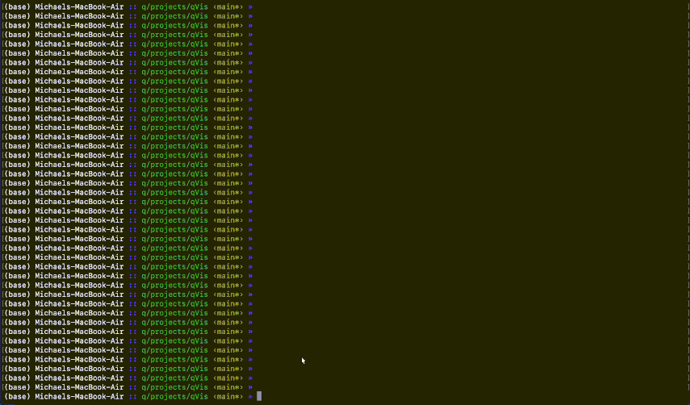
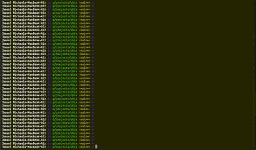
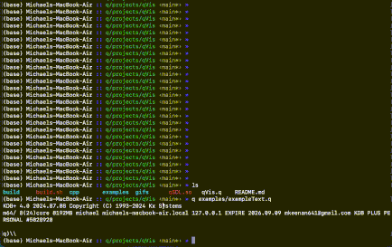
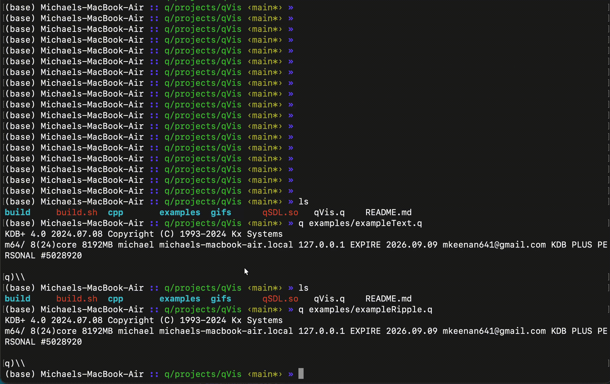
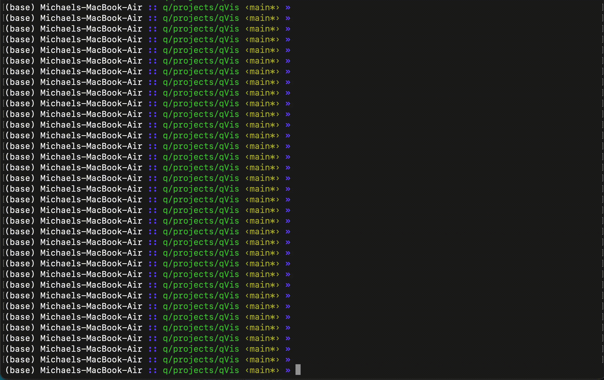

# qVis

<p align="center">
  
  
</p>

**qVis** is a graphical engine for [kdb+/q](https://kx.com): it opens a 60fps, resizable SDL3 window directly from the q REPL, without blocking the session. It provides immediate-mode drawing primitives (pixels, lines, rectangles, circles, polygons, text), true TrueType/OpenType text rendering via SDL_ttf, translucent/alpha-blended fills, bulk pixel blasting via `setpixels`, edge-detected keyboard and mouse input, and an event callback that wakes q the moment input arrives (`seteventcb`). The C++ layer lives in `native/qSDL.cpp`; `qVis.q` exposes it to q as the `.qvis` namespace.

Two applications ship on top of the engine:

- 💻 **[qOS](#-qos-retro-desktop)** (`qOS.q`) - a retro desktop environment *inside your q session*: a teal desktop with pixel-art icons, a taskbar with a start menu and clock, and freely movable, resizable windows. Each window hosts a live view of the session - table browsers, charts, a namespace explorer, a memory monitor, a q console, an editor - and the desktop also launches the bundled games and simulations.
- 🔍 **[The .vis Workspace Inspector](#-the-vis-workspace-inspector)** (`inspect.q`) - a single-window visual inspector for kdb+. Browse, sort, and filter tables of any size, explore namespaces, plot line/scatter/histogram/candlestick/bar charts, watch live views of streaming tables, build dashboards, and run q code in a syntax-highlighted editor - all while the session stays live.

qOS is built *from* the inspector: it reuses the same `.vis` views, but instead of one view taking over the screen, every view opens as a desktop window. Same API, two front ends.

```
native/qSDL.cpp  →  qVis.q (.qvis)  →  inspect.q (.vis)  →  qOS.q (.qos)
  SDL3 in C++       drawing engine     workspace views      desktop windows
```

---

## Contents

- [Quickstart](#quickstart)
- [qOS Retro Desktop](#-qos-retro-desktop)
- [The .vis Workspace Inspector](#-the-vis-workspace-inspector)
- [Guided Tour (demo.q)](#-guided-tour-demoq)
- [Using the qVis Engine](#-using-the-qvis-engine)
- [Showcase Apps & Games](#-showcase-apps--games)
- [API Reference](#-api-reference)
- [File Structure](#-file-structure)

---

## Quickstart

**Supported OS:** macOS and Linux.

**1. Install dependencies (SDL3, SDL3_ttf, and CMake):**
- **macOS:** `brew install sdl3 sdl3_ttf cmake`
- **Linux (Ubuntu/Debian):** `sudo apt install libsdl3-dev libsdl3-ttf-dev cmake build-essential`

**2. Clone, build, and run:**
```sh
git clone https://github.com/mkeenan-kdb/qVis.git
cd qVis
./native/build.sh
q demo.q -qos        # the qOS desktop, preloaded with demo data
q demo.q -inspect    # or the single-window inspector tour
```

---

## 💻 qOS Retro Desktop

**qOS** is a desktop environment for kdb+/q, styled like an old operating system. Everything on screen is a live view of your q session: open the namespace explorer in one window, a billion-row table browser in another, a streaming candle chart in a third, and drive it all from the q console window or your own terminal - the windows update as the session changes.

### Quickstart

Run the demo with the `-qos` flag:
```sh
q demo.q -qos
```

Or load it into any running q session:
```q
\l qOS.q
.qos.start[]      / opens the desktop; .qos.stop[] closes it
```

### Using the desktop

- **Desktop icons** (double-click) and the **qOS start menu** open the built-in apps: q Console, Editor, Games, Simulations, Namespaces, Tables/DB, Memory Monitor, About.
- **Windows**: drag the title bar to move, the corner grip to resize; title buttons are `_` minimise, `o` maximise, `x` close. Click a taskbar button to focus or minimise a window.
- **Drill-downs stack inside their window**: click a table row to inspect the record, right-click a cell to copy/filter/plot it, right-click a function for "open in editor". `Esc` goes back one level, and closes the window at its root view.
- **q Console**: a terminal-style REPL with shell history. Any q expression runs in the live session; table results open in a table-browser window; `\cmd` runs system commands; `\\` shuts down.
- **Games and Simulations folders**: launch the bundled showcase apps (the FPS, Doom, boids, fluid, Mandelbrot, ...) from the desktop. An app takes over the canvas while it runs; `Esc` returns to the desktop exactly as you left it.
- **Right-click the desktop** for a launcher menu.

### Driving it from q

The whole `.vis` API opens desktop windows instead of taking over the screen - from the q Console window or the terminal the session was started in:

```q
.vis.plot flip exec close by sym from daily     / line chart window
.vis.tab `trade                                 / table browser window
.vis.ns[]                                       / namespace explorer
.vis.watchAs[.demo.feed;250;`candle]            / live-updating chart
```

### Event-driven, not timer-driven

The native layer wakes q the moment keyboard, mouse, or window events arrive (via `.qvis.seteventcb`), so clicks, typing, and window drags render immediately with no polling latency. `.z.ts` serves only as an animation heartbeat - qOS keeps `\t` at the slowest rate the visible windows actually need: 1s for the taskbar clock when idle, faster only while a console cursor is blinking or a live watch / memory monitor is on screen. An idle desktop repaints once a second instead of thirty times.

### Tunables

| Variable | Default | Meaning |
| :--- | :--- | :--- |
| `.qos.TB` / `.qos.TH` | 26 / 14 | Taskbar / title-bar height (px). |
| `.qos.MINW` / `.qos.MINH` | 220 / 140 | Minimum window size. |
| `.qos.DESK` | `0x008080` | Desktop colour. |

---

## 🔍 The .vis Workspace Inspector

`inspect.q` is a self-contained interactive GUI loaded into a live q session - the single-window inspector that qOS builds its windows from. Data in the window reflects the current state of the session. All views share a navigation stack: clicking drills down, `Esc` goes back. The window opens at 80% of your display size and is freely resizable by dragging its edges - the canvas is letterboxed/pillarboxed to keep its aspect ratio rather than stretching.

### Getting Started

Run from the repo root:

```sh
q inspect.q
```

Or load into an existing q session at any point:

```q
\l inspect.q
```

Then call any inspector function:

```q
.vis.tab[`trade]              / browse a table (symbol name or in-memory value)
.vis.ns[]                     / explore namespaces and variables
.vis.db[]                     / partitioned database overview
.vis.mem[]                    / live memory monitor
.vis.plot[exec price from trade where date=max date, sym=`AAPL]
.vis.hist[returns; 60]
.vis.scatter[xs; ys]
.vis.candle[daily]            / OHLC candlestick (open/high/low/close columns)
.vis.bar[`a`b`c; 1 5 3]       / bar chart with labels
.vis.watch[`trade; 1000]      / live plot of the table tail, refreshed every 1s
.vis.watchAs[`trade; 500; `tab]  / live view kinds: `plot, `candle, `tab, `hist or `bar
.vis.dash ((`plot;`sensors;0 0 2 1); (`candle;{select from daily where sym=`AAPL};0 1 1 1); (`tab;`trade;1 1 1 1;500))
                               / tile several live views into one window
.vis.repl[]                   / open the multiline q editor
```

### Table Browser (`.vis.tab`)
Browses any table - in-memory, keyed, splayed, or date-partitioned - without loading it fully into RAM. Rows are fetched lazily so even billion-row HDB tables are usable. Click a column header to sort ascending or descending (the sort index is kept in memory; the table is never copied - sorts over `.vis.MAXSORT` rows are refused to avoid OOM). Click a row to see the full record with all columns untruncated. Right-click a cell for a context menu: copy the value, filter the table by it, plot the column, or inspect the row. Type `/where-clause` (e.g. `/price>100`) at the command bar to open a filtered view - `Esc` clears it. Use `Left`/`Right` arrow keys to page through columns that do not fit the window.

### Namespace Explorer (`.vis.ns`)
Walks the q namespace tree. Each entry shows the symbol name, kind (table, function, variable, namespace), type code, element count, and serialised size. Click any entry to drill into a namespace, open a table in the table browser, or view a function's source or a variable's value. Right-click a function or variable for an "open in editor" option that jumps straight into `.vis.repl` with its source pre-loaded, ready to tweak and re-run. Right-click any entry to copy its name; type `/substring` at the command bar to filter entries by name. The view refreshes after every command-bar expression, so deleting or redefining a global is reflected immediately.

### Partitioned Database Viewer (`.vis.db`)
Shows every table in the loaded HDB with a bar chart of row counts across partitions, making it easy to spot missing or thin partitions. Click a table name to open it in the table browser.

### Live Memory Monitor (`.vis.mem`)
Plots `.Q.w[]` fields (used, heap, peak, mmap, syms) as horizontal bars with a scrolling history graph of `used`. Useful for watching memory grow during a query or after loading data.

### Charts
- **`.vis.plot[x]`** - line chart, with a translucent shaded fill under each line down to the plot floor. Accepts a numeric vector (single line), a list of vectors (one line per element), or a table (numeric columns become lines, a time or date column becomes the x-axis). Points are placed by their real x value, not row position - irregularly spaced time series and series of different lengths land where they actually belong instead of stretching to fill the width. Infinite values are dropped from the axis range so a stray `1%0` doesn't take down the view. Hovering shows a crosshair with the nearest value per series.
- **`.vis.hist[x; n]`** - histogram with `n` buckets.
- **`.vis.scatter[x; y]`** - 2D scatter plot with x-axis ticks and a hover crosshair readout; nulls and infinities are dropped. Points are drawn translucent, so overlapping points compound into visibly denser clusters instead of one flat smear. `x` can be a temporal vector - ticks and the crosshair readout format it accordingly.
- **`.vis.candle[t]`** - OHLC candlestick chart of a table with `open`/`high`/`low`/`close` columns; more candles than fit the window are bucketed (first/max/min/last) so the shape survives. Hovering shows a crosshair with the OHLC values under the cursor.
- **`.vis.bar[x; y]`** - bar chart of `y` values labelled by `x`; bars grow from a zero baseline so negative values hang below it.
- **`.vis.watch[t; ms]`** - live plot: re-fetches the newest `.vis.WROWS` rows of `t` (a table name or a nullary function returning a table) every `ms` milliseconds.
- **`.vis.watchAs[t; ms; kind]`** - same refresh loop, any view: `` `plot `` (what `.vis.watch` uses), `` `candle ``, `` `tab `` for a follow-the-tail table browser (a graphical `tail -f`), `` `hist `` (bins the first numeric column), or `` `bar `` (first symbol/string column as labels, first numeric column as values).

### Dashboards (`.vis.dash`)
Tiles several live views into one window on a grid:

```q
.vis.dash (
  (`plot;   `sensors;                                     0 0 2 1);
  (`candle; {select from daily where sym=`AAPL};          0 1 1 1);
  (`tab;    `trade;                                       1 1 1 1; 500))
```

Each panel is `(kind; src; cell)` or `(kind; src; cell; ms)` (default 1000ms): `kind` is any `.vis.watchAs` kind, `src` is anything `.vis.watch` accepts (table name, nullary function, or a value), and `cell` is `(col; row; colspan; rowspan)` on a grid sized to fit every panel. Panels are display-only - click or right-click one to zoom into a full live `.vis.watchAs` view of it, with all the usual interactivity (sort, filter, command bar); `Esc` returns to the grid. See `apps/exampleDashboard.q` for a complete streaming example.

**Pitfall - only the top of the stack redraws.** If one panel's `src` is a function that advances a feed (appends rows, mutates a global) and other panels merely *read* the resulting table, the readers only look live while the driving panel is also visible - the moment you zoom into a reader panel, the driver stops being called and its data freezes. Give every panel that needs to look live its own `src` that advances things itself (harmless to call the same feed function from multiple panels - each call just appends), or accept that reference panels showing already-static data (a historical table, a fixed aggregate) simply won't animate, which is fine when that's the intent.

### q REPL (`.vis.repl`)
A multiline q editor with syntax highlighting. `.vis.repl[]` opens a persistent scratch buffer that survives across open and close. `.vis.repl[f]` - where `f` is a function value, or a symbol/string naming one - instead opens the editor pre-loaded with that function's source, so you can jump into it from the terminal and tweak-and-rerun it directly (this is also what the namespace explorer's "open in editor" menu item uses).

- `Enter` - newline; `Cmd/Ctrl+Enter` - run the buffer and show the result below.
- `Tab` - insert two spaces.
- `Shift+Up/Down` - select lines; `Cmd/Ctrl+A` - select all.
- `Cmd/Ctrl+C` / `Cmd/Ctrl+X` - copy / cut selection to clipboard.
- `Cmd/Ctrl+V` - paste from clipboard.

### Command Bar
Every view (except the REPL, which has its own full editor) shows a `q)` prompt at the bottom of the window. Type any q expression and press `Enter`:

- The result appears above the bar and the view refreshes. Changes to the session (adding or removing globals, reloading a database) are reflected immediately.
- System commands work as in the console: `\l db`, `\t 100`, `\t`, and so on. `\\` closes the window and exits q.
- A line starting with `/` filters the current view instead of evaluating: a where-clause on a table view (`/price>100,sym=`AAPL`), a substring name match on the namespace view (`/stats`). The matches open as a new stacked view; `Esc` clears the filter.
- Expressions that open a view (`.vis.tab t`, `.vis.plot x`, etc.) push it onto the navigation stack. Press `Esc` to return.

### Navigation

| Action | Key / Input |
| :--- | :--- |
| Drill down / sort | Left-click |
| Context menu (copy / filter / plot / inspect) | Right-click |
| Filter the view | `/clause` at the command bar |
| Scroll (auto-repeats, accelerates on a long hold) | Mouse wheel or Up/Down/PageUp/PageDown |
| Go back / close menu | Esc |
| Quit | Window close button |

### Tunables

Globals you can set at any time to trade safety/speed for coverage:

| Variable | Default | Meaning |
| :--- | :--- | :--- |
| `.vis.MAXSORT` | 50M | Max rows to sort or plot a column of (both materialise one full column; larger tables are refused with a message). |
| `.vis.WROWS` | 10000 | Tail rows fetched per `.vis.watch` / `.vis.watchAs` refresh cycle. |
| `.vis.SZMAX` | 1M | Namespace explorer skips the serialised-size probe (`-22!`) for values with more items than this. |
| `.vis.TROWS` | computed from window height | Visible rows in table and text views. |

**If the window freezes:** q pauses timers and event callbacks while the session is at a debug prompt (`q))`) or busy evaluating an expression. The window cannot repaint until control returns. Type `\` at the terminal to leave the debugger and it resumes. This is normal q behaviour, not a hang.

---

## 🎯 Guided Tour (`demo.q`)

`demo.q` is the fastest way to see everything. It builds a realistic demo database and in-memory dataset, then prints a numbered menu (or opens the qOS desktop with `-qos`). Type `demo N` at the q prompt to run any entry:

```sh
q demo.q -[inspect|qos]
```

The dataset includes:
- `trade` - a 1M-row date-partitioned tick table with random-walk prices (six symbols, ten partitions)
- `daily` - 250 days of OHLC bars per symbol
- `sensors` - a day of 30-second sensor readings (temperature, pressure, vibration)
- `alltypes` - a table with one column of every common q type
- `returns`, `xs`, `ys` - numeric vectors for histogram and scatter plots
- `.stats` - a small namespace with functions and config to explore with `.vis.ns`

```
  demo 1   intraday price walk (partitioned query)    .vis.plot select time,price from trade where date=max date,sym=`AAPL
  demo 2   multi-series line plot, one per symbol     .vis.plot flip exec close by sym from daily
  demo 3   table plot with a time axis                .vis.plot sensors
  demo 4   histogram - normal returns                 .vis.hist[returns;60]
  demo 5   scatter - correlated pairs                 .vis.scatter[xs;ys]
  demo 6   table browser - 1M-row partitioned trade   .vis.tab `trade
  demo 7   table browser - every q column type        .vis.tab alltypes
  demo 8   partitioned-database overview              .vis.db[]
  demo 9   namespace explorer (drill into .stats)     .vis.ns[]
  demo 10  live memory monitor                        .vis.mem[]
  demo 11  multiline q editor/REPL                    .vis.repl[]
  demo 12  OHLC candlestick - AAPL daily bars         .vis.candle select from daily where sym=`AAPL
  demo 13  bar chart - total volume by symbol         {.vis.bar[key x;value x]} exec sum volume by sym from daily
  demo 14  live watch - tail of trade, 1s refresh     .vis.watch[`trade;1000]
  demo 15  LIVE candlestick - random-walk feed        .vis.watchAs[.demo.feed;250;`candle]
  demo 16  LIVE table tail - graphical tail -f        .vis.watchAs[.demo.feed;250;`tab]
  demo 17  dashboard - plot/candle/bar/tab tiled      .vis.dash (...)
```

The database is only built when `db/` is absent. Run `rm -rf db` and rerun `demo.q` to regenerate it.

---

## 🎨 Using the qVis Engine

Load `qVis.q` and open a window. All drawing functions live under `.qvis`, so nothing is added to the root namespace:

```sh
q qVis.q
```

```q
.qvis.init[320; 240; 2]       / open a 320x240 window at 2x scale
.qvis.clear[.qvis.black]      / fill with black
.qvis.circle[160; 120; 80; .qvis.red]
.qvis.present[]               / push the frame to screen
.qvis.shutdown[]              / close the window
```

The window is freely resizable by dragging its edges - the `320x240` canvas is always letterboxed/pillarboxed to fill it without distortion, so drawing coordinates never need to change.

---

## 📸 Showcase Apps & Games

A sample of what you can build on the `qVis` engine (including two games that my kids strongly suggested as a developmental avenue). All of these live in [apps/](apps/) - launch them from the qOS desktop's Games and Simulations folders, or run any of them from the repo root:

```sh
q apps/exampleDashboard.q
```

| Program | Description | Preview |
| :--- | :--- | :--- |
| **Workspace Inspector**<br>[inspect.q](inspect.q) | Browse tables, namespaces, memory, and charts - loaded into your live q session. | <details><summary>View</summary></details> |
| **Interactive Dashboard**<br>[apps/exampleDashboardRaw.q](apps/exampleDashboardRaw.q) | Streaming financial chart with crosshairs and indicators. See `exampleDashboard.q` for the `.vis.dash` version. | <details><summary>View</summary></details> |
| **Demon Arena (FPS)**<br>[apps/fps.q](apps/fps.q) | First-person shooter on a heightmap raycaster. Climbable stairs, pixel-art sprites. | <details><summary>View</summary></details> |
| **Touchdown Run**<br>[apps/football.q](apps/football.q) | 3D arcade runner with Verlet ragdoll physics. Dodge defenders. | |
| **Doom-Style Maze**<br>[apps/exampleDoom.q](apps/exampleDoom.q) | Wolfenstein-style 3D maze rendering with textures and collision detection. | <details><summary>View</summary></details> |
| **Interactive Ray Tracer**<br>[apps/exampleRay.q](apps/exampleRay.q) | CPU ray tracer with shadows, sphere intersections, and camera rotation. | <details><summary>View</summary></details> |
| **Mandelbrot Explorer**<br>[apps/exampleMandelbrot.q](apps/exampleMandelbrot.q) | Fractal explorer with WASD panning and dynamic zoom (R/F). | <details><summary>View</summary></details> |
| **Conway's Game of Life**<br>[apps/exampleLife.q](apps/exampleLife.q) | 1920x1080 cellular automaton, fully vectorised in native q. | <details><summary>View</summary></details> |
| **Water Ripple**<br>[apps/exampleRipple.q](apps/exampleRipple.q) | 2D wave-equation solver showing ripple propagation and interference. | <details><summary>View</summary></details> |
| **Bouncing Ball**<br>[apps/exampleBounce.q](apps/exampleBounce.q) | Gravity physics using basic drawing primitives, with a translucent motion trail. | <details><summary>View</summary></details> |
| **Plasma Wave Effect**<br>[apps/exampleAnimation.q](apps/exampleAnimation.q) | Sine-wave plasma computed in q and blasted to the canvas via `setpixels`. | <details><summary>View</summary></details> |
| **Text Rendering**<br>[apps/exampleText.q](apps/exampleText.q) | Bitmap font showcase: scaling, marquee scrolling, and colour animation. | <details><summary>View</summary></details> |
| **Boids**<br>[apps/exampleBoids.q](apps/exampleBoids.q) | Flocking algorithm (separation, alignment, cohesion) in vectorised q. | |
| **Finance Order Book**<br>[apps/exampleFinance.q](apps/exampleFinance.q) | Live-streaming limit order book and trade price charts. | |

---

## 📋 API Reference

### `qVis.q` - Drawing Engine (`.qvis` namespace)

| Function | Arguments | Description |
| :--- | :--- | :--- |
| `.qvis.init` | `[w; h; scale]` | Opens a window of logical size `w*h` pixels at `scale` display scale. |
| `.qvis.clear` | `[colour]` | Fills the back buffer with a 32-bit ARGB colour. |
| `.qvis.pixel` | `[x; y; colour]` | Draws a single pixel. |
| `.qvis.line` | `[x1; y1; x2; y2; colour]` | Draws a line between two points. |
| `.qvis.rect` | `[x; y; w; h; colour]` | Draws a filled rectangle. |
| `.qvis.circle` | `[x; y; r; colour]` | Draws a filled circle. |
| `.qvis.polygon` | `[xs; ys; colour]` | Draws a filled simple polygon (scanline fill) through the given vertex coordinates. |
| `.qvis.text` | `[x; y; scale; colour; str]` | Renders a string using the built-in 5x7 bitmap font. |
| `.qvis.loadfont` | `[path; pt_size]` | Loads a TrueType/OpenType font file and returns an integer font id. |
| `.qvis.loadsysfont` | `[style; pt_size]` | Loads the bundled open-source fallback font (Roboto/Roboto Mono) for `` `prop `` or `` `mono `` and returns the font id, or `-1i` if it fails. |
| `.qvis.drawtext` | `[x; y; font_id; colour; str]` | Renders a string with a font loaded via `loadfont`/`loadsysfont`. |
| `.qvis.textsize` | `[font_id; str]` | Returns `(width; height)` in pixels of `str` rendered with `font_id`. |
| `.qvis.displaysize` | `[]` | Returns a dict `` `w`h `` of the primary monitor's usable display bounds. |
| `.qvis.setpixels` | `[buf]` | Blits a `w*h` integer list of ARGB colours directly to the back buffer. |
| `.qvis.getpixel` | `[x; y]` | Reads back the composited RGB colour currently at `(x;y)` in the back buffer. |
| `.qvis.present` | `[]` | Flushes the back buffer to the screen. |
| `.qvis.keyz` | `[]` | Returns a symbol list of all keys currently held down. |
| `.qvis.mouse` | `[]` | Returns a dict `x`y`l`r`w`c` of mouse position, button state, wheel delta, and window-close flag. |
| `.qvis.textin` | `[]` | Returns characters typed since the last call as a char vector (read-and-reset). Use this rather than `keyz` to handle text input correctly. |
| `.qvis.clipboard` | `[]` | Returns the system clipboard contents as a char vector. |
| `.qvis.setclip` | `[str]` | Writes `str` to the system clipboard. |
| `.qvis.poll` | `[]` | Returns a dict `new`held`click`rclick`mx`my`wheel`closed`text` with edge-detected input for the current frame (`click`/`rclick` fire on the frame the left/right button goes down). |
| `.qvis.pollReset` | `[]` | Clears edge-detection state. Call this when reopening a view. |
| `.qvis.seteventcb` | `[name]` | Registers a unary q function by name (e.g. `".qos.FRAMETS"`) that the native event pump applies on the q main thread whenever keyboard/mouse/window events arrive - the push alternative to polling from a `.z.ts` loop, so input renders the moment it happens and `\t` is left for animation. `""` disables; cleared by `shutdown`. |
| `.qvis.shutdown` | `[]` | Closes the window and releases resources. |

**Predefined colours:** `.qvis.black`, `.qvis.white`, `.qvis.red`, `.qvis.green`, `.qvis.blue`, `.qvis.yellow`, `.qvis.cyan`, `.qvis.magenta`, `.qvis.gray`. Any 32-bit integer is accepted, e.g. `0xFF8800i` for orange. Every drawing function honours the colour's alpha byte for translucent fills - build one with `.qvis.fade[a; colour]` (`a` 1-255) rather than by hand, e.g. `.qvis.fade[80; .qvis.cyan]` for a mostly-see-through cyan.

### `inspect.q` - Workspace Inspector (`.vis` namespace)

These open desktop windows when qOS is running, or stacked views in the single-window inspector otherwise.

| Function | Arguments | Description |
| :--- | :--- | :--- |
| `.vis.tab` | `[t]` | Opens the table browser for `t` (symbol name or in-memory value). |
| `.vis.ns` | `[]` | Opens the namespace and variable explorer. |
| `.vis.db` | `[]` | Opens the partitioned database overview. |
| `.vis.mem` | `[]` | Opens the live memory monitor. |
| `.vis.repl` | `[]` or `[f]` | Opens the multiline q editor: `[]` reopens the persistent scratch buffer, `[f]` (a function, or a symbol/string naming one) pre-loads that function's source. |
| `.vis.plot` | `[x]` | Line chart. Accepts a numeric vector, list of vectors, or table (a temporal column becomes the x-axis with time-aware tick marks). |
| `.vis.hist` | `[x; n]` | Histogram of `x` with `n` buckets. |
| `.vis.scatter` | `[x; y]` | 2D scatter plot of two numeric vectors, with a hover crosshair readout. |
| `.vis.candle` | `[t]` | OHLC candlestick chart of a table with `open`/`high`/`low`/`close` columns. |
| `.vis.bar` | `[x; y]` | Bar chart of `y` values labelled by `x`, drawn from a zero baseline. |
| `.vis.watch` | `[t; ms]` | Live plot of the newest `.vis.WROWS` rows of `t` (table name or nullary function), re-fetched every `ms` milliseconds. |
| `.vis.watchAs` | `[t; ms; kind]` | Live view of any kind: `` `plot ``, `` `candle ``, `` `tab `` (follow-the-tail table browser), `` `hist ``, or `` `bar ``. |
| `.vis.dash` | `[panels]` | Tiles several live views (any `.vis.watchAs` kind) into one window on a grid; click a panel to zoom into a full live view of it (single-window inspector only - on qOS, windows are the dashboard). |

### `qOS.q` - Desktop (`.qos` namespace)

| Function | Arguments | Description |
| :--- | :--- | :--- |
| `.qos.start` | `[]` | Opens the desktop (loads on `q qOS.q` automatically). |
| `.qos.stop` | `[]` | Closes the desktop and restores the session's `.z.ts` and `\t`. |

---

## 📁 File Structure

| Path | Description |
| :--- | :--- |
| [native/](native/) | C++ SDL3 wrapper source and the build script (`native/build.sh`). |
| [qVis.q](qVis.q) | Drawing engine - loads `native/qSDL.so` and exposes the `.qvis` API. |
| [inspect.q](inspect.q) | Workspace inspector application (`.vis`). |
| [qOS.q](qOS.q) | The qOS retro desktop window manager (`.qos`). |
| [demo.q](demo.q) | Guided tour - builds demo data, then opens the inspector menu (`q demo.q -[inspect|qos]`). |
| [apps/](apps/) | Standalone graphics programs and playable games. |
| [gifs/](gifs/) | Animated screenshots used in this README. |
| [tests/](tests/) | Headless smoke tests (`q tests/smoke.q -q`, `q tests/smoke_qos.q -q`). |
